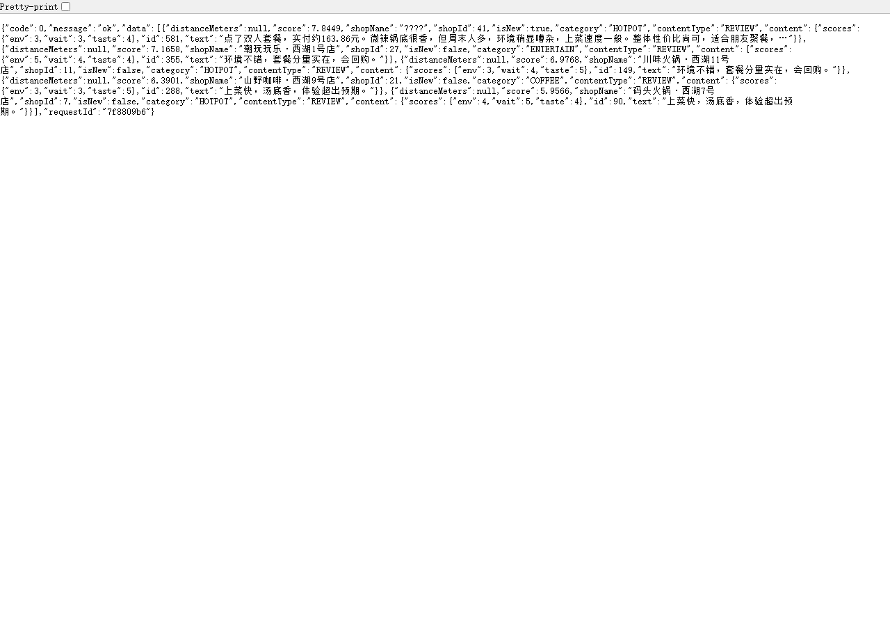

# 本地生活双端 Agent 平台（代号 ScoutBite 探店雷达）

本地生活双端 Agent MVP：用户被 Agent 推荐到店并完成评价，商家被 Agent 分析并行动。

## 架构一句话

**Agent 不直连数据库**：它只能通过 shop-api 的 `/internal` 只读接口拿「瘦事实」，写操作永远走用户 JWT。

```
Vue3(web) ──用户JWT──▶ shop-api(Spring Boot :8081) ──转发──▶ agent-api(FastAPI :8000)
                          ▲   │                                │
                     PG/Redis/MinIO ◀──JDBC──┘   （起回头调 /internal 拿瘦事实）
```

## 快速开始

```powershell
# 一键全家桶（Docker 三件套 + shop-api + agent-api + web）
powershell -ExecutionPolicy Bypass -File deploy\start-all.ps1

# 验收
#   http://localhost:8081/swagger-ui.html   ← 主站 Swagger（9 个分组）
#   http://localhost:8081/actuator/health   ← {"status":"UP"}
#   http://localhost:8000/docs              ← Agent 文档站
```

## 种子账号（DataSeeder 自动写入，密码以 seeder 为准）

| 手机号 | 密码 | 角色 | 说明 |
|---|---|---|---|
| 13900000000 | admin123456 | ADMIN | 管理员（不开放注册） |
| 13611110001 | user123456 | USER | 辣妹小队长（吃辣党画像） |
| 13611110002 | user123456 | USER | 奶爸阿伦（亲子党画像） |
| 13611110003 | user123456 | USER | 咖啡因选手（咖啡党画像） |

## 压测与对账（真实数字）

**压测** `python deploy/loadtest_claims.py`：200 并发抢 100 张券（券3·店1，per_user_limit=1）

- ① 不超卖：成功 = 100 ≤ 100，100 人被 40902/40901 业务性拒绝
- ② Redis 余量 = 0 == 100 − 100
- ③ DB user_coupons 新增 100 行 == 成功数（13900000100~205 段独立用户）
- ④ 同人 20 并发双击只成功 1 次（幂等）

**关单对账** `python deploy/close_order_check.py`（等真实超时 35s，非造数）：

- 用例A（无券）：订单 75 → CANCELLED_TIMEOUT，SKU5 库存回补
- 用例B（用券）：订单 76 → CANCELLED_TIMEOUT，SKU6 库存回补 + 券5 FROZEN→UNUSED
- 三源独立对账：订单表 / SKU 表 / 券表 互相印证

## 离线评测

`python evals/run_eval.py --full` → 报告 [evals/reports/latest.md](evals/reports/latest.md)

| 技能 | 用例 | 通过率 | p50 | 硬约束指标 |
|---|---|---|---|---|
| recommend | 30 | 100% | 3361ms | 品类/预算/引用存在率全过 |
| review-draft | 20 | 90% | 1322ms | 2 例 no_fabrication 诚实记录为失败 |
| merchant | 15 | 100% | 2512ms | 观察/假设/建议三层 + 无确定性断言 |

LLM 成本：107 次调用 ≈ ¥0.6184。失败用例与评测边界见报告第 5 节。

## 探索开关同屏对比（explore=true|false）

新店（7 日内过审）×2 探索加成。同一请求只切开关：新店(shopId 41) score 从 **15.69 → 7.84**，其余店不变。

| explore=true | explore=false |
|---|---|
|  |  |

> 本轮种子数据中新店内容质量恰好也高，关掉开关排名未掉出前 3——score 数值差异是开关生效的直接证据。

## 目录

| 路径 | 说明 |
|---|---|
| services/shop-api | Spring Boot 3 · Java 21 · 业务与鉴权 :8081 |
| services/agent-api | FastAPI + LangGraph · Agent 大脑 :8000 |
| apps/web | Vue 3 前端 :5173 |
| deploy | docker-compose（PG / Redis / MinIO）+ 压测/对账脚本 |
| docs | PRD / ADR / ER / 演示稿 / [known-issues](docs/known-issues.md) |
| evals | Agent 评测数据集与报告 |
| 学习指南 | 十日工坊学习站点（离线 HTML） |

## 端口清单（本机环境导致的偏移，见 docs/decisions.md ADR-015/019）

| 端口 | 服务 | 备注 |
|---|---|---|
| 8081 | shop-api | Swagger: /swagger-ui.html；原计划 8080 被 aio-sandbox-mcp 容器占用 |
| 8000 | agent-api | 文档: /docs |
| 5173 | web (Vite) | 起 |
| 5433 | postgres (容器) | 宿主 5433 → 容器 5432，**避本机已装的 PG** |
| 6380 | redis (容器) | 宿主 6380 → 容器 6379，**避本机已装的 Redis** |
| 9000/9001 | minio | S3 API / 控制台（scoutbite / scoutbite123） |

## 统一返回与错误码

```json
{ "code": 0, "message": "ok", "data": {}, "requestId": "a1b2c3d4" }
```

| code | 含义 |
|---|---|
| 0 | 成功 |
| 40001 | 参数/约束错误 |
| 40100 | 未登录 |
| 40300 | 角色不对 |
| 40901 | 幂等冲突或重复评价 |
| 40902 | 库存或券不足 |
| 40903 | 状态机冲突 |
| 42201 | Agent 护栏拦截 |

## 已知问题（诚实清单）

演示项目的已知局限与升级路径见 [docs/known-issues.md](docs/known-issues.md)——包括 2 例菜品级编造抓拍、评论聚类为关键词分桶、草稿仓内存化等 8 项。

详见 `docs/` 与 `docs/api.http`（VS Code REST Client 可直接执行联调用例）。
